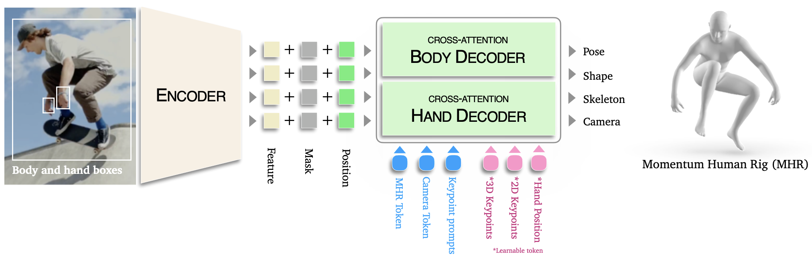

# Sam 3D Body (de Meta)



Modèle promptable (points clés 2D, masque (quelle personne à analyser), info caméra)

**Encoder** : Représentation latente de l’image. Renvoie des token : Image Token. 

+ prompts : Mask, Position.. 

**Decoder** : 2 décodeurs : 1 pour les mains et 1 pour le corps. C’est dans ce décodage qu’il y a de l’attention (self et cross) grace aux Query Tokens en bleu et roses. Il y en a 6. 

- 3 bleus (liés à l’entrée / la sortie principale du modèle). Initialisés pseudo aléatoirement sauf Keypoint prompts.
    - Keypoint prompts
    - Camera token
    - MHR  token
- 3 roses (token internes, auxiliaires ou “learnable”). Initialisés aléatoirement.
    - 2D keypoints
    - 3D keypoints
    - Hand Position

Tous ces token passent par : 

- Concaténation : T = [T_pose (MHR + caméra), T_prompt, T_keypoint2D, T_keypoint3D, T_hand]
- Self attention.
- Cross attention : Il posent les questions aux Images Tokens issus de l’encodage.

Query Token : Q. Image Token : K et V. 

```jsx
RESUME BOUCLE TRAINING : 
IMAGE
  ↓
ENCODER → image tokens
  ↓
CONCAT query tokens
  ↓
L(nb couche du décodeur) x [Self-Att → Cross-Att → MLP(pour la non linéarité et la proj vers l'espace de sortie)]
  ↓
MHR params (θ)
  ↓
LOSS
  ↓
BACKPROP
  ↓
UPDATE (poids, token learnables)
```

Les token sont entrainés (self et cross attention) en supervisé. Ils sont mis à jour grâce à des sorties auxiliaires du modèle : 2D keypoints et 3D keypoints. Ces sorties auxiliaires ne sont pas dispo dans le code de l’inférence.  

En sortie : pas de SMPL mais : Momentum Human Rig (MHR). Différence : squelette (os) forme (chair). Ici, la shape est découpée du squelette. 

Sortie : θ = {Pose, Shape, Camera, Skelette}

Pose : angles des articulations

| Clé (par personne) | Shape (numpy) | Nature | Représente quoi ? | Produit dans | Utilisé dans / sert à |
| --- | --- | --- | --- | --- | --- |
| `bbox` | (4,) | entrée/metadata | Boîte XYXY (image originale) de la personne | prepare_batch.py puis empaqueté dans sam_3d_body_estimator.py | crop/top-down, debug/visu |
| `focal_length` | () scalaire | caméra (intrinsèque) | $f_x$ (pixels), lu comme `cam_int[0,0]` | [sam_3d_body/sam_3d_body/models/heads/camera_head.py](https://www.notion.so/sam_3d_body/sam_3d_body/models/heads/camera_head.py) (renvoie `cam_int[:,0,0]`) | calcul de `t_z`, reprojection 3D→2D, rendu mesh (Renderer) [sam_3d_body/sam_3d_body/visualization/renderer.py](https://www.notion.so/sam_3d_body/sam_3d_body/visualization/renderer.py) |
| `pred_cam_t` | (3,) | caméra (extrinsèque) | Translation caméra $(t_x,t_y,t_z)$ utilisée pour passer du 3D “root-centered” au repère caméra avant projection | camera_head.py | reprojection 3D→2D, placement du mesh en caméra (`vertices + pred_cam_t`) vis_utils.py |
| `pred_keypoints_3d` | (70,3) | géométrie | 70 keypoints 3D (format “mhr70”) dans le repère “modèle” (avant ajout de `pred_cam_t`) | mhr_head.py (slice 308→70) | downstream (ton mapping body25), ou reprojection si tu ajoutes `pred_cam_t` |
| `pred_keypoints_2d` | (70,2) | géométrie | 2D reprojetés en pixels (image originale) | projection dans sam3d_body.py via `camera_project` et/ou dans `PerspectiveHead.perspective_projection` | visu + supervision 2D + extraction 2D (ton code) |
| `pred_vertices` | (V,3) (V≈18439) | géométrie | Sommets du mesh MHR (root-centered). V est celui du modèle MHR chargé (dans ce repo, la visu suppose 18439) | mhr_head.py | rendu mesh + export PLY, placement en caméra via `+ pred_cam_t` [renderer.py](http://renderer.py/) |
| `pred_joint_coords` | (127,3) | géométrie | Coordonnées 3D des 127 joints internes MHR | mhr_head.py | biomécanique/IK/angles, raffinage mains (indices de joints codés) sam3d_body.py |
| `pred_global_rots` | (127,3,3) | rotations | Rotations globales des joints (matrices 3×3) | mhr_head.py | raffinage mains + potentiellement extraction d’angles articulaires |
| `global_rot` | (3,) | pose | Rotation globale (Euler) du corps (convention donnée par `roma.rotmat_to_euler("ZYX", ...)`) | mhr_head.py | interprétation orientation globale / repère |
| `body_pose_params` | (133,) | pose (MHR “model params”) | Pose du corps en paramètres MHR (133 dims) issue de la conversion “compact cont → model params” | conversion dans mhr_utils.py appelée depuis mhr_head.py | reconstruction MHR + potentiellement biomécanique (mais ce sont des paramètres internes, pas des angles nommés directement) |
| `hand_pose_params` | (108,) | pose (compact) | 2×54 paramètres compacts mains (convertis ensuite en 2×27 “model params” et injectés) | mhr_head.py + conversion mhr_utils.py | reconstruction détaillée des mains, raffinage mains (mode full) |
| `shape_params` | (45,) | shape latent | Coeffs de forme (PCA/latent) pour le MHR | mhr_head.py | reconstruction mesh/joints ; peu “interprétable” coefficient par coefficient |
| `scale_params` | (28,) | scale latent | Coeffs PCA qui génèrent `scales` (68,) via `scale_mean + scale_params @ scale_comps` | mhr_head.py | contrôle morpho/squelette ; utilisé aussi pour corriger les mains en mode full |
| `expr_params` | (72,) | face/expr latent | Ici forcé à 0 (`pred_face * 0`) : expression/face désactivée | mhr_head.py | quasi inutile dans cette config |
| `pred_pose_raw` | (266,) | pose interne réseau | Concat (rot globale 6D + pose “cont” 260). Sert aux itérations/prompts; peut être invalidé après “re-forward” (commentaire “not valid anymore”) | mhr_head.py + logique prompt dans sam3d_body.py | initialisation/raffinement (prompt), pas idéal comme paramètre biomécanique direct |
| `mhr_model_params` | (~204,) | paramètres MHR effectifs | Le vecteur réellement envoyé au modèle MHR: concat d’un “pose+trans” (136) + `scales` (68) ⇒ ~204 | construit dans `mhr_forward` mhr_head.py | reconstruction exacte MHR (avec `shape_params`) |
| `mask` | (H,W,1) ou `None` | entrée optionnelle | Masque de segmentation si fourni/calculé | sam_3d_body_estimator.py | inférence conditionnée masque (si activée) |

### Licence :

Cette licence permet d’utiliser, modifier et redistribuer librement SAM (même commercialement), à condition de respecter la licence et les lois, sans usages sensibles (militaire, armes, etc.), et en acceptant que Meta n’offre aucune garantie ni responsabilité.